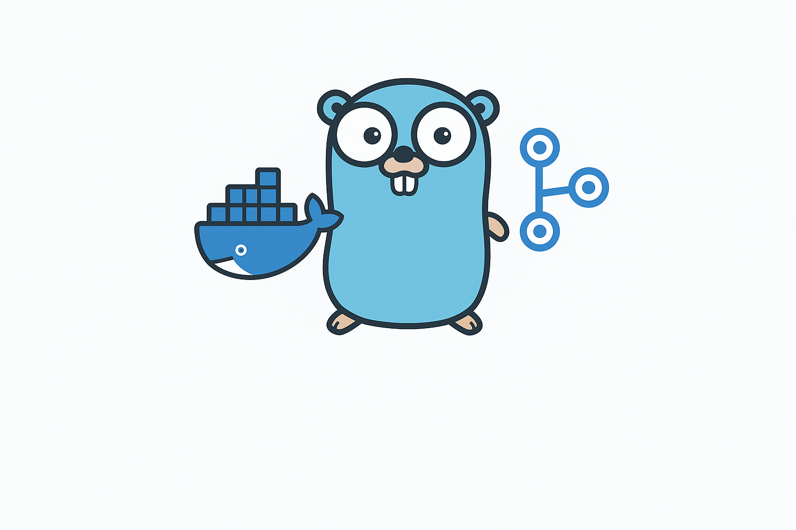

# actions-runner-compose

[](https://github.com/KillWolfVlad/actions-runner-compose/actions/workflows/deploy-image.yaml)

<p align="center">
  
  <br>
</p>

Like [Kubernetes controller for GitHub Actions self-hosted runners](https://github.com/actions/actions-runner-controller) but for Docker Compose.

## Install

### On Your Server

1. `mkdir actions-runner-compose && cd actions-runner-compose`
2. `nano .env` with content from [.env.example](./.env.example)
3. `nano compose.yaml` with content below (you can find versions in [GitHub Packages](https://github.com/users/KillWolfVlad/packages/container/package/actions-runner-compose))

```yaml
name: actions-runner-compose

services:
  actions-runner-compose:
    container_name: arc
    image: ghcr.io/killwolfvlad/actions-runner-compose:latest
    restart: unless-stopped
    environment:
      PORT: "8080"
      WEBHOOK_PATH: ${WEBHOOK_PATH}
      WEBHOOK_SECRET: ${WEBHOOK_SECRET}
      MAX_RUNNERS: ${MAX_RUNNERS}
      RUNNER_IMAGE: ${RUNNER_IMAGE}
      REPOSITORY_0: ${REPOSITORY_0}
      REPOSITORY_1: ${REPOSITORY_1}
    ports:
      - 8080:8080
    volumes:
      - /var/run/docker.sock:/var/run/docker.sock
```

4. `docker compose up -d`
5. Setup Caddy or any other reverse proxy

```caddy
yourdomain.com {
    reverse_proxy http://localhost:8080
}
```

### Setup WebHook in GitHub Repository

- Payload URL: `yourdomain.com/${WEBHOOK_PATH}`
- Content type: `application/json`
- Secret: `${WEBHOOK_SECRET}`
- SSL verification: `Enable SSL verification`
- Which events would you like to trigger this webhook: `Let me select individual events.`
  - `Workflow jobs`
- Active: `true`

## Maintainers

- [@KillWolfVlad](https://github.com/KillWolfVlad)

## License

This repository is released under version 2.0 of the
[Apache License](https://www.apache.org/licenses/LICENSE-2.0).
